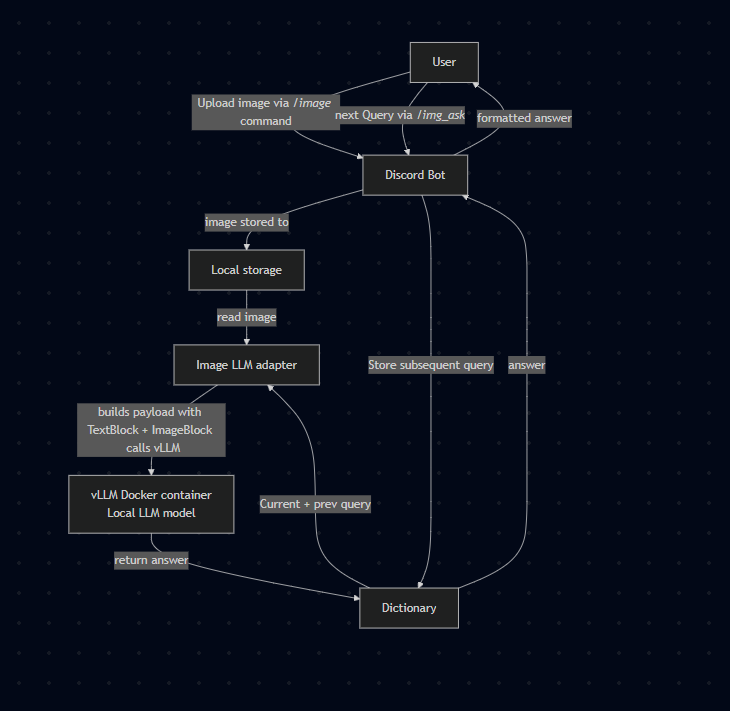

# discord-genai-bot

Lightweight Discord bot that accepts an uploaded image, sends it to a local vLLM instance via an OpenAI-compatible API, and returns a concise description + tags. The multimodal logic lives in `image_cap_flow/discord_img_llm.py` and the Discord integration is in `discord_bot.py`.

## Quick overview

- Bot framework: `discord.py` (application commands / interactions)
- Local LLM serving: vLLM OpenAI-compatible server (`vllm/vllm-openai` Docker image)
- Integration adapter: `llama_index.llms.openai_like.OpenAILike` to call the local vLLM API

## What this README covers

- How to run the bot locally (PowerShell on Windows)
- How to run vLLM in Docker (model hosting and API)
- Which models and APIs the project expects
- A simple system design diagram and operational notes

## Requirements

- Docker (GPU support recommended for large models)
- Python 3.13+ (use a virtual environment)
- uv (optional, for faster setup)
- Environment variables: `DISCORD_TOKEN` and `GUILD_ID` (see below)

The Full Python dependencies are in `requirements.txt`. At minimum this project uses:

- discord.py
- python-dotenv
- llamaindex

Install them with pip (see next section).

## Environment variables

Create a `.env` file in the repo root with the following keys:

**DISCORD_TOKEN**=`<your-bot-token>`
**GUILD_ID**=`<your-discord-guild-id>`

Optional / model-related tokens (if you plan to pull models via other APIs):
**HF_TOKEN** (only if needed to download models to the host before running vLLM)

Do not commit your `.env` file.

## Setup and run (PowerShell)

1) Create and activate a virtual environment

```powershell
python -m venv .venv
.\.venv\Scripts\Activate.ps1
```

2) Install Python dependencies

```powershell
pip install --upgrade pip
pip install -r requirements.txt
# If you prefer the `uv` runner install it optionally:
pip install uv
```

3) Create `.env` with `DISCORD_TOKEN` and `GUILD_ID`. or send them as environment vars

4) Start the local vLLM server (see next section) and ensure it serves an OpenAI-like API at `http://localhost:8000/v1`.

5) Run the bot

```powershell
# Run via plain python
python .\discord_bot.py

# Or if you have the `uv` runner installed (the author used `uv run .\discord_bot.py`):
uv run .\discord_bot.py
```

The bot registers application commands on startup. When you first run the bot it will attempt to sync commands for the guild id in `GUILD_ID`.

## vLLM Docker setup (model serving)

This project expects a locally running model server that exposes an OpenAI-compatible API. The included `start_vllm.ps1` shows a sample Docker command used by the author. The important pieces:

- Docker image: `vllm/vllm-openai:latest`
- Model path inside container: `/models/<model-name>` (the script uses `/models/qwen3vl_2b`)
- Port forwarded to host: `8000` (OpenAI-like API base will be `http://localhost:8000/v1`)

Example (from `start_vllm.ps1`):

```powershell
docker run --runtime nvidia --gpus all --name vllm_container -v F:\Studies\hface_cache:/models \
    -p 8000:8000 --ipc=host \
    vllm/vllm-openai:latest \
    --model /models/qwen3vl_2b \
    --gpu-memory-utilization 0.85 \
    --quantization fp8 \
    --kv-cache-dtype fp8 \
    --max_model_len 3312 \
    --max-num-batched-tokens 2048
```

Notes:
- Replace the host path `F:\Studies\hface_cache` with a directory on your machine containing the model files (or where the model will be downloaded).
- The example requires an NVIDIA GPU and Docker configured to expose GPU devices. If you don't have a GPU you can still run a smaller model on CPU, but performance will be much slower.
- The vLLM image exposes an OpenAI-compatible API (the code calls `http://localhost:8000/v1`).
- Direct Huggingface repo id can also be used, but it adds to the startup time since it takes time to download
- Increase `max_model_len` to have longer context window, consumes more gpu
- Params like `gpu-memory-utilization`, `max-num-batched-tokens` are based on experiments

## Models and APIs used

- **Model**: `Qwen/Qwen3-VL-2B-Instruct` (example model path used in `start_vllm.ps1`). You can substitute any model compatible with the vLLM server.
- **Serving**: vLLM OpenAI-compatible server (`vllm/vllm-openai`) exposing `/v1` endpoints. Used for ensuring decent throughput over ease of use with `Ollama`
- **Other models**: Experimented with `llava-hf/llava-onevision-qwen2-0.5b-ov-hf`, `gemma-3-4b` but found **Qwen** to be make most of my **local gpu**.


Behavioral notes from the code:
- The image is read locally and sent as an `ImageBlock` alongside a `TextBlock` prompt in a `ChatMessage` list.
- Short answer and tagging constraints are part of the prompt in `start_conversation_with_image`.
- Conversation context is cached in-memory in `_conversations: Dict[str, List[ChatMessage]]` keyed by `session_id` (stringified user id). This is ephemeral and will be lost when the bot restarts.


## System design (ASCII diagram)
```
flowchart TD
    U[User] -->| Upload image via */image* command | DB[Discord Bot]
    DB -->| image stored to | CAC[Local storage] -->| read image | ILA[Image LLM adapter]
    ILA -->| builds payload with TextBlock + ImageBlock <br> calls vLLM | VLLM[vLLM Docker container<br> Local LLM model]
    VLLM -->| return answer | D[Dictionary] -->| answer | DB -->| formatted answer | U
    U -->| next Query via */img_ask* | DB -->|Store subsequent query | D -->| Current + prev query | ILA
```


Key implementation notes:
- Conversation memory is in-memory only. For production, persist conversation state (Redis, DB) to handle process restarts and multiple workers.
- The code uses an OpenAI-compatible endpoint; this makes it simple to swap between remote OpenAI or local vLLM as long as the API shape is compatible.

## */* commands
**Bot Commands:**
- `/image <upload>` — Describe or tag an uploaded image
- `/help` — Show this message
- `/show_files` — Show uploaded files
- `/ping` — Test command will always reply 'pong'

**Image Follow-up Commands:**
- `/img_ask <query>` — Ask follow-up questions about the last uploaded image will probably work on a more powerful model than the experimented one
- `/img_clear` — Clear stored image/context for your session, to upload a newer image

## Discord installation
Use this link https://discord.com/oauth2/authorize?client_id=1444320985972084938 and give the permissions, install on a test server and give the `GUILD_ID` and `DISCORD_TOKEN`


## Notes
- If running the Docker container with GPUs, ensure Docker has GPU access configured (NVIDIA Container Toolkit).
- Port 8000 must be free on the host for the vLLM server.
- The default code uses `api_key="EMPTY"` for the local vLLM; if you secure your vLLM server, update `image_cap_flow/discord_img_llm.py` with the key.

## Troubleshooting

- Bot commands are set to only work in a single server (configured by `GUILD_ID`) can be expanded to global if needed.
- "Bot doesn't respond / commands not registered": ensure `GUILD_ID` is set and the bot has permission to register commands for that guild. Check the bot logs for sync errors.
- The configured context window in vLLM, can only support 2 or 3 roundabouts before filling up the context window, context can be increased in `--max-model-len` argument.

## Where to look in the code

- Discord interaction handlers: `discord_bot.py`
- Multimodal prompt/adapter: `image_cap_flow/discord_img_llm.py` (look at `start_conversation_with_image`, `ask`, and `_extract_text_from_response`)
